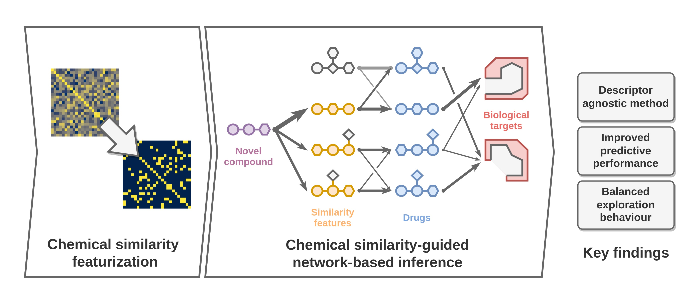

# *De novo* prediction of drug targets and candidates by chemical similarity-guided network-based inference

*NOTE:* Moved to [schuellerlab/ijms2022_simspread](https://github.com/schuellerlab/ijms2022_simspread).
